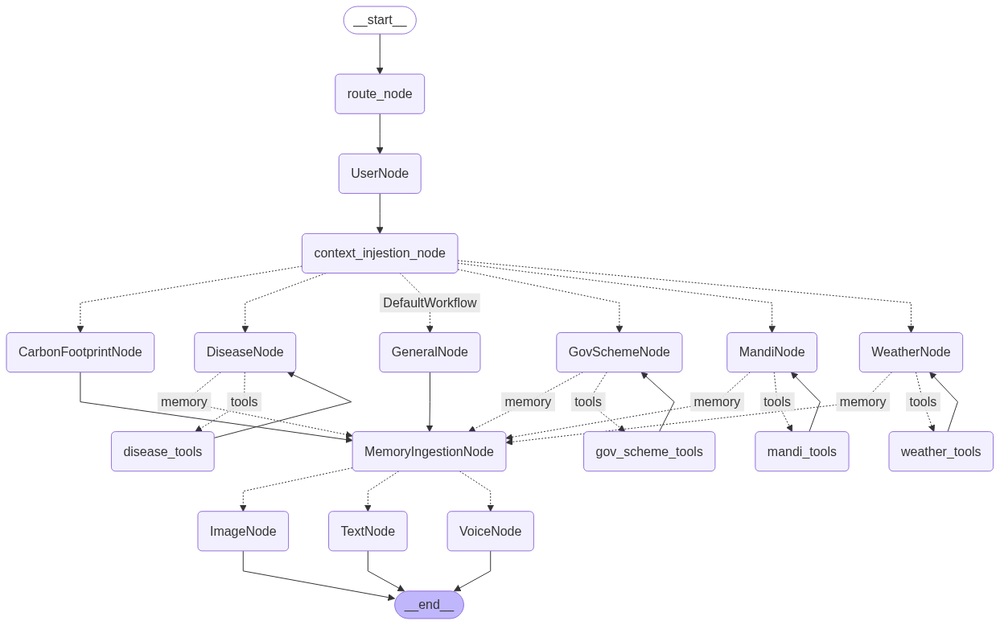

# Project-Kisan
This project to help the farmers by giving the all advance facility at one place

###  Environment setup
```
uv venv
.venv\Scripts\activate
```
## Requirements setup
```
uv pip install -r requirements.txt
```


## 📁 Project Structure
src/ai_component/
├── core/
│   ├── __init__.py
│   ├── prompts.py              # System prompts and templates
│   └── schedules.py            # Task scheduling logic
├── graph/
│   ├── utils/                  # Graph utility functions
│   ├── __init__.py
│   ├── edges.py                # Graph edge definitions
│   ├── graph.py                # Main graph implementation
│   ├── nodes.py                # Node definitions and logic
│   └── state.py                # State management
├── modules/
│   ├── memory/                 # Memory system components
│   └── schedule/               # Scheduling modules
├── tools/
│   ├── __init__.py
│   ├── mandi_report_tool.py
│   ├── rag_tool.py
│   ├── weather_tool.py
│   └── web_search_tool.py
├── __init__.py
├── config.py                   # Configuration settings
├── exception.py                # Custom exceptions
├── llm.py                      # LLM integration
└── logger.py                   # Logging utilities


### Root level files
├── .gitignore
├── .python-version
├── LICENSE
├── README.md
├── main.py                     # Application entry point
├── pyproject.toml              # Project configuration
├── requirements.txt            # Python dependencies
├── setup.py                    # Package setup
├── uv.lock                     # UV lock file
└── workflow.png                # Workflow diagram


## 🏗 Architecture

The system follows a modular workflow architecture with the following components:

### Core Workflow
- *Start Node*: Entry point for all requests
- *Route Node*: Intelligent routing based on user intent
- *Context Injection Node*: Adds contextual information to requests
- *Memory Ingestion Node*: Handles different types of memory storage and retrieval

### Specialized Nodes

#### Domain-Specific Nodes
- *CarbonFootprintNode*: Calculate and analyze carbon footprint data
- *DiseaseNode*: Medical information and disease-related queries
- *GeneralNode*: General purpose queries and conversations
- *GovSchemeNode*: Government schemes and policy information
- *MandiNode*: Agricultural market data and pricing
- *WeatherNode*: Weather forecasting and climate data

#### Memory Processing Nodes
- *ImageNode*: Process and analyze images
- *TextNode*: Handle text-based memory and information
- *VoiceNode*: Process audio and voice inputs

### Tool Integration
Each specialized node has access to domain-specific tools:
- disease_tools: Medical databases and health information APIs
- mandi_tools: Agricultural market data sources
- weather_tools: Weather service integrations


## 🔧 Key Components

### Graph System (graph/)
- **nodes.py**: Contains all node implementations (CarbonFootprintNode, DiseaseNode, etc.)
- **edges.py**: Defines connections and transitions between nodes
- **graph.py**: Main graph orchestration and workflow management
- **state.py**: Manages application state throughout the workflow
- **utils/**: Utility functions for graph operations

### Memory System (modules/memory/)
- Handles multi-modal memory storage and retrieval
- Supports text, image, and voice memory ingestion
- Provides context-aware information retrieval

### Scheduling (modules/schedule/)
- Task scheduling and workflow management
- Handles asynchronous operations
- Manages node execution timing

### Core Configuration
- **pyproject.toml**: Modern Python project configuration
- **uv.lock**: UV dependency lock file for reproducible builds
- **setup.py**: Package installation configuration

## 🎯 Features

### Multi-Modal Support
- *Text Processing*: Natural language understanding and generation
- *Image Analysis*: Visual content processing and analysis
- *Voice Processing*: Audio input handling and transcription

### Domain Expertise
- *Healthcare*: Disease information, symptoms, treatments
- *Environment*: Carbon footprint calculations and environmental data
- *Agriculture*: Market prices, crop information, farming insights
- *Government*: Policy information, scheme details, eligibility criteria
- *Weather*: Forecasts, climate data, weather patterns

### Memory System
- Context-aware conversations
- Long-term memory storage
- Multi-modal memory ingestion
- Intelligent information retrieval

## 🛠 Development

### Adding New Nodes
1. Create a new node class in the appropriate module
2. Define the node's tools and capabilities
3. Update the routing logic in route_node
4. Add corresponding prompts in core/prompts.py


## 📊 Workflow

1. *Request Reception*: User query enters through the start node
2. *Intelligent Routing*: Route node determines the appropriate specialized node
3. *Context Addition*: Relevant context is injected into the request
4. *Processing*: Specialized node processes the query using domain-specific tools
5. *Memory Integration*: Results are stored in the memory system
6. *Response Generation*: Final response is generated and returned

## 🔍 Logging

The system includes comprehensive logging:
- Request/response tracking
- Error handling and debugging
- Performance monitoring
- Tool usage analytics

## 🤝 Contributing

1. Fork the repository
2. Create a feature branch
3. Make your changes
4. Add tests for new functionality
5. Submit a pull request

## 📝 License

This project is licensed under the terms specified in the LICENSE file.

## 🆘 Support

For issues and questions:
- Check the documentation
- Review existing issues
- Create a new issue with detailed information


## 🔮 Future Enhancements
- Additional specialized nodes for more domains
- Enhanced memory capabilities
- Real-time learning and adaptation
- API endpoint development
- Web interface integration


